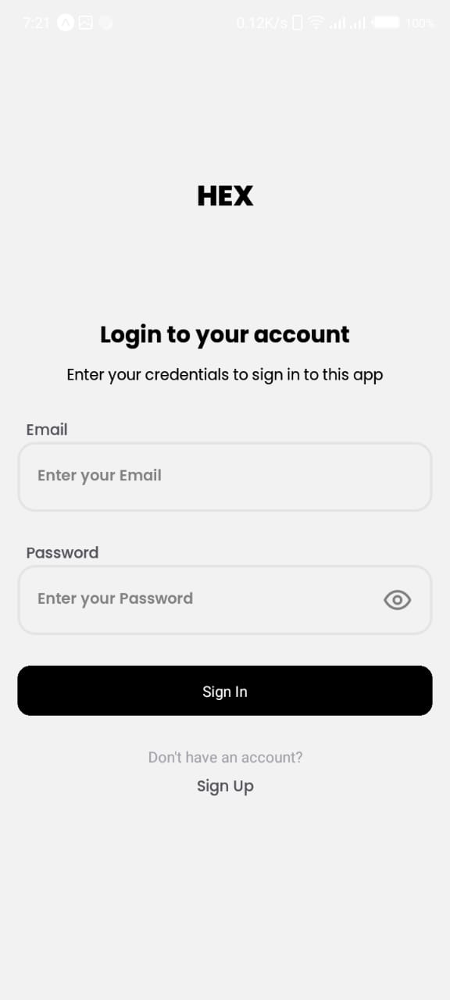
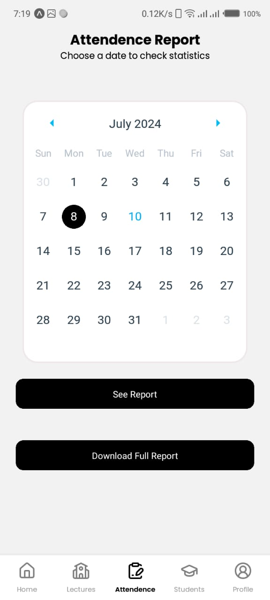
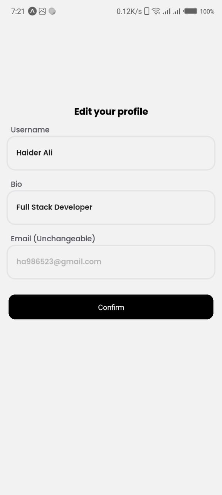
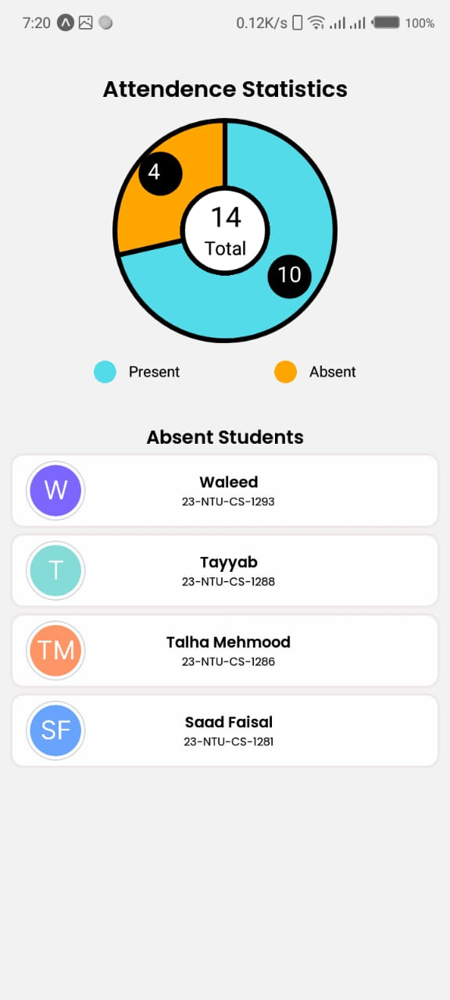
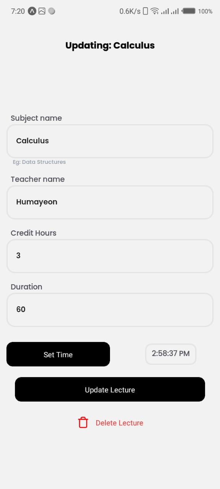
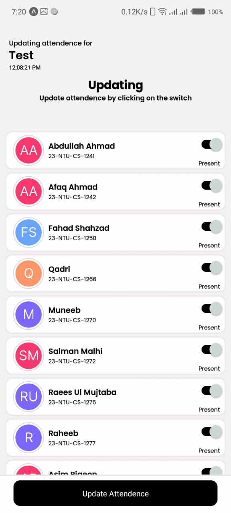

# 📚 Attendy

An Attendance Manager for universities, especially for NTU.

## 🚀 Get Started

1. **Install dependencies**

   ```bash
   npm install
   ```

2. **Start the app**

   ```bash
   npx expo start
   ```

## 🌟 Features

1. 🔒 User Authentication
2. 🖥️ User-friendly UI
3. ☁️ All attendance is saved online
4. 📝 Ability to add/manage lectures
5. 👩‍🎓👨‍🎓 Ability to add/manage students
6. 📊 Export attendance in CSV file

## 🛠️ Technologies Used

1. React Native
2. Appwrite
3. TypeScript
4. Expo
5. TailwindCSS (NativeWind)
6. Tanstack Query
7. Zod
8. Zustand
9. Many more... (read `package.json`)

## 🏗️ Setting Up This Project Locally

### 📂 Clone the Repo

### 🌐 Create an Account on Appwrite

### 🗄️ Create a Database

### 📝 Add These Collections with All CRUD Permissions

- **users**

  - `username`: string
  - `email`: Email
  - `avatar`: URL
  - `accountID`: string
  - `bio?`: string

- **classes**

  - `name`: string
  - `semester`: integer
  - `cr`: 1-1 relation with users

- **students**

  - `name`: string
  - `roll_no`: string
  - `avatar`: URL
  - `class`: N-1 relation with classes

- **lectures**

  - `name`: string
  - `teacher`: string
  - `time`: Datetime
  - `duration`: integer
  - `day`: integer
  - `credit_hours`: integer
  - `classes`: N-1 relation with classes

- **attendance**
  - `marked_at`: Datetime
  - `only_date`: string
  - `absent_students`: N-N relation with users
  - `lecture`: N-1 relation with lectures

### 🔐 Add These Environment Variables to Your `.env` File

```
EXPO_PUBLIC_PROJECT_ID=
EXPO_PUBLIC_PLATFORM=
EXPO_PUBLIC_ENDPOINT=
EXPO_PUBLIC_DATABASE_ID=
EXPO_PUBLIC_USERS_COLLECTION_ID=
EXPO_PUBLIC_STUDENTS_COLLECTION_ID=
EXPO_PUBLIC_ATTENDANCE_COLLECTION_ID=
EXPO_PUBLIC_LECTURES_COLLECTION_ID=
EXPO_PUBLIC_CLASSES_COLLECTION_ID=
EXPO_PUBLIC_STORAGE_ID=
```

## 📸 Screenshots

<p>






</p>
